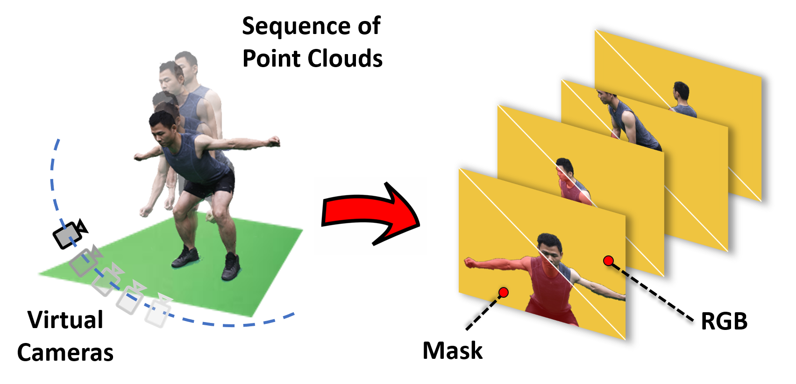

# Multi-view Neural Human Rendering (NHR) [[Project Page]]() [[Paper]](http://openaccess.thecvf.com/content_CVPR_2020/papers/Wu_Multi-View_Neural_Human_Rendering_CVPR_2020_paper.pdf) 

Pytorch implementation of NHR.


**Multi-view Neural Human Rendering** </br>
[Minye Wu](https://github.com/wuminye), Yuehao Wang, Qiang Hu, Jingyi Yu.</br>
In CVPR 2020.</br>

## Abstract
We present an end-to-end Neural Human Renderer (NHR) for dynamic human captures under the multi-view setting. NHR adopts PointNet++ for feature extraction (FE) to enable robust 3D correspondence matching on low quality, dynamic 3D reconstructions. To render new views, we map 3D features onto the target camera as a 2D feature map and employ an anti-aliased CNN to handle holes and noises. Newly synthesized views from NHR can be further used to construct visual hulls to handle textureless and/or dark regions such as black clothing. Comprehensive experiments show NHR significantly outperforms the state-of-the-art neural and image-based rendering techniques, especially on hands, hair, nose, foot, etc. 


## Licenses

<a rel="license" href="http://creativecommons.org/licenses/by-nc-sa/4.0/"></a><br />This work is licensed under a <a rel="license" href="http://creativecommons.org/licenses/by-nc-sa/4.0/">Creative Commons Attribution-NonCommercial-ShareAlike 4.0 International License</a>.

All material is made available under [Creative Commons BY-NC-SA 4.0](https://creativecommons.org/licenses/by-nc-sa/4.0/legalcode) license by Adobe Inc. You can **use, redistribute, and adapt** the material for **non-commercial purposes**, as long as you give appropriate credit by **citing our paper** and **indicating any changes** that you've made.


## Get Started
The designed architecture follows this guide [PyTorch-Project-Template](https://github.com/L1aoXingyu/PyTorch-Project-Template), you can check each folder's purpose by yourself.

Dependencies:
- python 3.6
- [pytorch>=1.2](https://pytorch.org/)
- torchvision
- opencv
- [ignite=0.2.0](https://github.com/pytorch/ignite)
- [yacs](https://github.com/rbgirshick/yacs)
- [Antialiased CNNs](https://github.com/adobe/antialiased-cnns)
- [Pointnet2.PyTorch](https://github.com/sshaoshuai/Pointnet2.PyTorch)
- [apex](https://github.com/NVIDIA/apex)
- [PCPR](https://github.com/wuminye/PCPR)


**1.Dataset preparing**
A data folder with a structure like following: 
```
.
├──  img
│    └── %d    					- the frame number, start from 0.
│        └──mask
│        	└── img_%04d.jpg	- foreground mask of corresponding view. view number start from 0. 
│        └──img_%04d.jpg   		- undistorted RGB images for each view. view number start from 0.
│
├──  pointclouds				
│    └── frame%d.npy			- point cloud for each frame. A numpy array with a size of Nx6, where N is the size of point cloud. Each row is the "x y z r g b". The frame number start from 1.
│
├──  CamPose.inf				-Camera extrinsics. In each row, the 3x4 [R T] matrix is displayed in columns, with the third column followed by columns 1, 2, and 4, where R*X^{camera}+T=X^{world}.
│
└──  Intrinsic.inf				-Camera intrinsics. The format of each intrinsics is: "idx \n fx 0 cx \n 0 fy cy \n 0 0 1 \n \n" (idx starts from 0)
```

**2. Network Training**
- modify configure file [config.yml](./configs/config.yml)
- start training  `cd tools && python train_net.py <gpu id>`

**2. Network Fine-tuning**
- run  `cd tools && python finetune.py <gpu id> <path to checkpoint> <the number of resuming epoch>`

**3. Rendering**
- Coming soon


